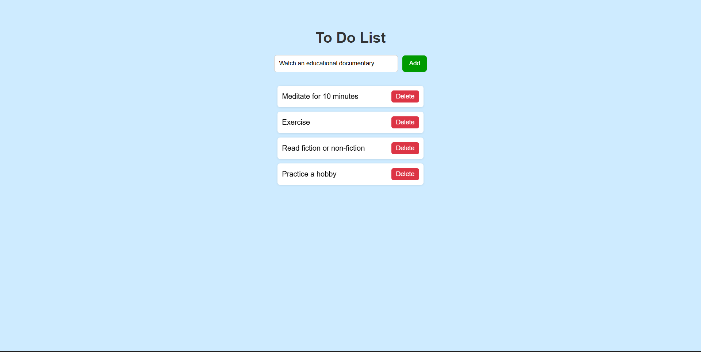

# To-Do List – JavaScript Practice Project

To-Do List is a simple task management application built using **HTML, CSS, and JavaScript** as part of frontend practice.  
The main goal of this project is to practice **JavaScript DOM manipulation**, event handling, and basic UI interactions.


## 🎯 Project Objective

> This project helped strengthen my understanding of JavaScript fundamentals by building an interactive to-do application.

- Practice **DOM manipulation**
- Handle **user input**
- Dynamically add and remove elements
- Improve confidence in JavaScript basics
- Build a clean and simple UI


## 🛠️ Technologies Used

- HTML5  
- CSS3  
- JavaScript (Vanilla JS)


## 📁 Project Structure

todo-list-js/
│
├── index.html
├── style.css
└── script.js


## ✨ Features

- Add tasks to the to-do list
- Delete tasks individually
- Simple and user-friendly interface
- Beginner-friendly code structure


## ⭐ Key Highlights

- Pure JavaScript (no frameworks)
- Focus on DOM manipulation
- Clean beginner-friendly logic
- Hosted using GitHub Pages


## 📘 Learning Outcomes

- Learned how to create and manipulate DOM elements
- Improved understanding of JavaScript functions and events
- Gained experience handling user input dynamically


## 🚀 How to Run the Project

1. Clone the repository
   ```bash
   git clone https://github.com/dinishsg/todo-list-js.git
2. Open index.html in any web browser.


## 📸 Screenshots




## 🌐 Live Demo

🔗(https://dinishsg.github.io/todo-list-js/)
